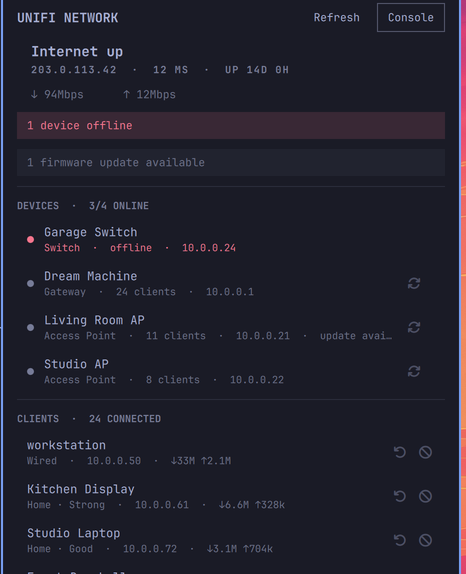

# UniFi Network for Omarchy

[](https://github.com/pkeenan87/omarchy-ubiquiti-plugin/actions/workflows/ci.yml)
[](LICENSE)
[](https://plugins.omarchy.org)



A bar widget for a UniFi OS console — Dream Machine, Cloud Gateway, UDM Pro,
UDR, or UniFi OS Server. It shows what your network is doing without opening
the UniFi app, and handles the two things you usually open the app for:
restarting a device and blocking a client.

In the bar it is a single icon that turns your theme's urgent colour when
something is wrong. A healthy network stays visually quiet and costs one
icon slot.

The figures — throughput and client count — live in the panel, and in the
tooltip if you just hover. Both can be put in the bar with `showThroughput`
and `showClients` if you would rather read them there.

## Install

```bash
git clone https://github.com/pkeenan87/omarchy-ubiquiti-plugin
cd omarchy-ubiquiti-plugin
./install.sh
omarchy-unifi setup
```

`setup` asks for your console's address and site, then prints the exact URL of
your console's Integrations page — something like:

```
https://192.168.1.9/network/default/integrations
```

Open that, **Create API Key**, and paste it in. The key is shown once, so copy
it before closing the dialog.

Setup verifies the connection before saving anything, then enables the
background poller. If it cannot connect, nothing is written.

## Removing it

```bash
./uninstall.sh
```

`omarchy plugin remove` deletes the plugin directory only. This plugin also
installs a systemd user service, a CLI symlink, a config file holding your API
key, and a state file listing your network — so removing it through the plugin
manager alone leaves a poller enabled against a binary that no longer exists,
and your credentials on disk.

`uninstall.sh` stops and removes the service, removes the symlink and the
plugin, and asks whether to delete the API key, the pinned certificate, and
the state file. `--purge` answers yes, `--keep-config` answers no. Revoke the
key on the console afterwards — deleting the local copy does not revoke it.

## What you get

**In the bar.** One icon, refreshed by a background service. The label turns urgent when the internet drops or a device goes
offline. Firmware updates are shown in the panel but never colour the bar —
a deferred update is a normal state to sit in, not an outage. A small dot marks a stale reading —
the console became unreachable — so a frozen number never reads as a live one.

- **Left click** — open the panel
- **Middle click** — refresh now
- **Right click** — open the console's web UI

**In the panel.** Internet status with IP, latency, uptime, and throughput;
every adopted device with its kind, address, client count and firmware state;
the busiest clients with signal quality and current throughput; and anything
you have blocked.

Hovering a row brings its actions to full strength. Devices can be restarted.
Clients can be reconnected or blocked, and blocked clients unblocked.
Restarting and blocking ask for confirmation first; reconnecting does not,
because a client normally comes straight back.

Reconnect disconnects the client and lets it reassociate — a phone is usually
back within a second, so there is nothing to watch. Every action confirms
itself in the panel for a few seconds afterwards, because most of them
succeed invisibly and silence reads as failure.

## Configuration

Widget settings live in `~/.config/omarchy/shell.json` and hot-reload on save:

| Key | Default | Meaning |
|-----|---------|---------|
| `showClients` | `false` | Show the client count in the bar |
| `showThroughput` | `false` | Show WAN throughput in the bar |
| `refreshIntervalSec` | `10` | Poll rate while the panel is open |
| `maxClients` | `25` | Clients listed in the panel |

```json
{ "id": "io.github.pkeenan87.unifi-network", "maxClients": 20, "showThroughput": true }
```

Console settings live in `~/.config/omarchy-unifi/config.json` (mode `0600`):
`host`, `apiKey`, `site`, `verifySsl`, `pollIntervalSec`, `timeoutSec`.

### Certificate trust

The API key is a full-admin credential for the console, so it must only ever
be sent to the console. Consoles ship a self-signed certificate that no CA
will vouch for, so `setup` reads the certificate the console is presenting —
before the key is ever transmitted — and pins its SHA-256. Every later request
checks it during the handshake and aborts the connection on a mismatch, so
nothing is sent to an impostor.

If the console's certificate legitimately changes (firmware update, factory
reset), re-pin it:

```bash
omarchy-unifi trust-cert
```

That shows you both fingerprints and asks before replacing the pin. `doctor`
reports what is currently trusted.

Pinning compares the fingerprint rather than installing the certificate as a
trust anchor: a console presents an end-entity certificate (`CA:FALSE`), and
OpenSSL rejects such a certificate as an anchor with "invalid CA certificate"
even with `VERIFY_X509_PARTIAL_CHAIN`.

Set `verifySsl` to `true` if you have given the console a certificate your
machine already trusts; that uses normal CA verification and ignores the pin.

## Command line

```bash
omarchy-unifi status          # what the bar is showing, as text
omarchy-unifi status --json   # the full state file
omarchy-unifi clients         # every client with its MAC
omarchy-unifi devices         # every adopted device with its MAC
omarchy-unifi doctor          # check the address, key, TLS, and endpoints
omarchy-unifi poll            # refresh once
omarchy-unifi trust-cert      # re-pin after the console's certificate changes
omarchy-unifi restart <mac>
omarchy-unifi block <mac> | unblock <mac> | kick <mac>
```

`clients` and `devices` are where the MACs come from. Any format works —
`aa:bb:cc:dd:ee:ff`, `AA-BB-CC-DD-EE-FF`, `aabbccddeeff` — but a name is
rejected rather than sent, because UniFi answers "200 OK" for a MAC that
matches nothing and that looks identical to success.

`doctor` is the place to start when the panel looks wrong. It reports the
config path and its permissions, and probes both API surfaces separately so
you can tell a bad key from an unreachable host.

## How it works

The QML never speaks HTTP. `omarchy-unifi daemon` polls the console and writes
`~/.local/state/omarchy-unifi/state.json`; the panel watches that file and
shells back out to the same CLI for actions.

That split matters for three reasons: the API key never enters the shell
process, a hung or unreachable console can never stall the bar, and every
behaviour in the panel is reproducible from a terminal.

Reads and writes both use the console's `/proxy/network/api` surface, which on
UniFi OS accepts the same API key as the newer Integration API and is the only
one that exposes health rollups and client blocking. `doctor`
probes the Integration API too, so a key that only works there produces a
clear diagnosis rather than an empty panel.

The poller is a stdlib-only Python script — no pip, no node, nothing to keep
updated — and its systemd unit is confined to reading your home directory and
writing its own state file.

## Privacy

The state file lists every client on your network by name, MAC, and IP. It is
written `0600`, as is the config file holding your API key. Both live under
your home directory and are never sent anywhere.

An API key grants full access to the console until you revoke it, which you
can do at any time in the same Integrations screen that issued it.

There is deliberately no `UNIFI_API_KEY` environment variable: an exported
credential is readable in `/proc/*/environ` for every process you run and is
inherited by everything this CLI spawns. `UNIFI_API_KEY_FILE` points at a
file instead.

Client and device names come from the devices themselves (DHCP option 12), so
they are chosen by whoever owns them. They are rendered as plain text and
stripped of control characters, so a hostile name cannot impersonate another
client or break the layout.

## Requirements

- A UniFi OS console (Network 9.0 or newer for API keys)
- Omarchy with the Quickshell-based shell

External dependencies, all already present on Omarchy:

| Used | For |
|------|-----|
| `python3` (3.9+, stdlib only) | the poller and CLI — no pip packages |
| `systemd --user` | running the poller in the background |
| `xdg-terminal-exec` | opening a terminal for `setup` from the panel |
| `xdg-open` | the Console button |
| `openssl` | tests only, to generate a stub console certificate |

A self-hosted UniFi Network Application that is *not* running on UniFi OS does
not support API keys and will not work with this plugin.

## Tests

```bash
python3 -m unittest discover -s tests -v
```

The suite covers state shaping against realistic payloads and drives the
client end to end against a stub console with a self-signed certificate,
including auth failures, unreachable hosts, and every action payload.

## Contributing

Bug reports and pull requests are welcome — see [CONTRIBUTING.md](CONTRIBUTING.md).
Security issues go through [SECURITY.md](SECURITY.md), not the public tracker.

Release history is in [CHANGELOG.md](CHANGELOG.md).

## License

MIT — see [LICENSE](LICENSE).
